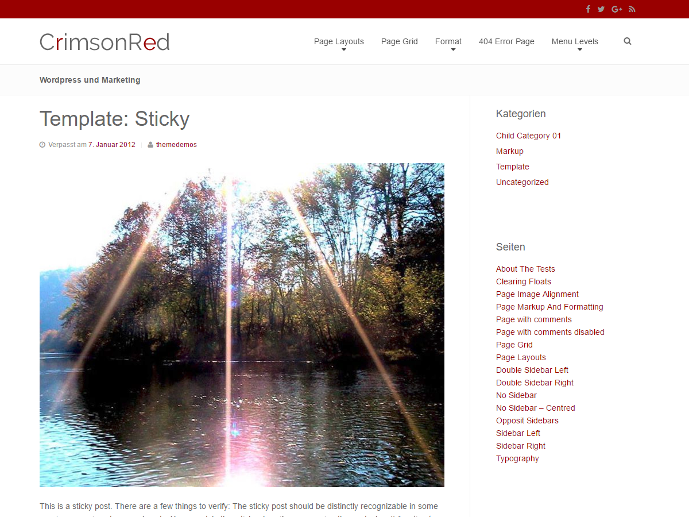

# j0e-crimson-red 
Crimson Red is a child-theme for the Beans framework (http://www.getbeans.io/). 

* Version 1.02 = Code cleanups
* Version 1.01 = Set $content_width for images and oembeds   
* Version 1.0  = Initial version  

# [Chrimson Red WordPress Theme](https://j0e.org/themes/crimson-red/)

# Size, color and font
Sidebar width: 250px  
Content width: 705px  
Image width: 705px  
Content width - No Sidebar: 1046px  
Content width - No Sidebar Centred: 800px  
Content width - Two Sidebars: 478px  

Text color: #666666 (Satans Gray)  
Link color: #990000 (Crimson Red)  
Complementary color: #009999 (Persian Green)  

Font: "Helvetica Neue", Helvetica, Arial, sans-serif 

## Preferred Wordpress Media settings
Thumbnail: 150 x 150 crop  
Medium: 350 x 0  
Big: 705 x 0  

# Features
## Four menus
* Primary (header)
* Secondary (below header - only visible if you have a menu assigned)
* Social (for social media icons - above the header)
* Footer (for privacy policy)

## Five widget areas
* Primary
* Secondary
* Footer
* Hero
* Offpage-Navigation

## Social media bar above the header

## Search menu in header (JS toggle)

## Image or text logo/site branding

## External links (with target="_blank") get a (Unicode: f08e) icon

## Five new editor buttons

